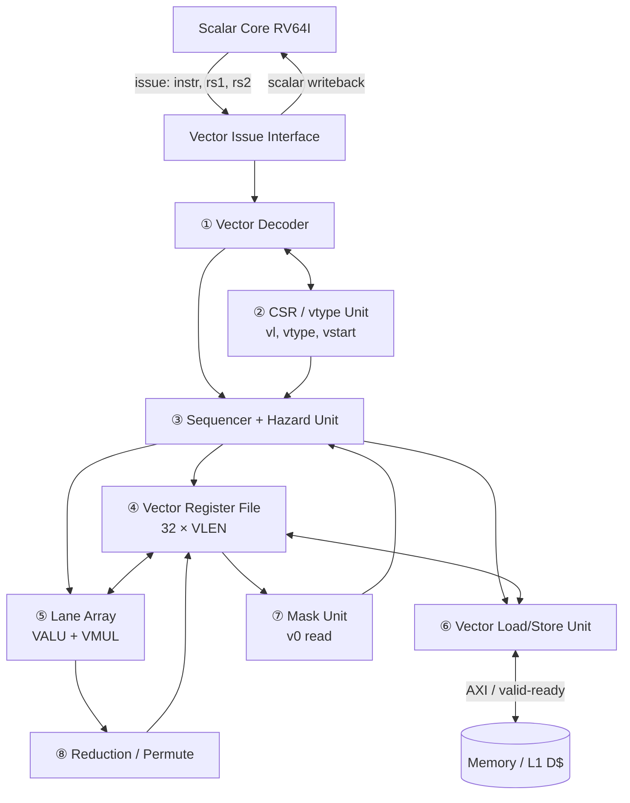

# Chapter 8 — The Big Picture

> **Goal of this chapter.** Present the complete MEDS-V block diagram, explain every block
> and every interface, and trace real instructions through it. This diagram is the map for
> the entire build — Chapter 9 zooms into each block, Chapter 11 turns it into a schedule,
> Chapter 12 turns it into files.
>
> **Print this chapter. Put the diagram on the wall.**

---

## 8.1 The fundamental choice: coupled or decoupled?

Before the diagram, one decision, because it changes everything downstream.

### Option A — Integrated vector unit

The vector unit is a functional unit inside the scalar pipeline, like the multiplier.
Shared decode, shared hazard logic, one register-scoreboard.

- ✅ Simple to reason about; no interface protocol to design
- ❌ Every vector instruction stalls the scalar pipeline for its whole duration
- ❌ Two teams cannot work in parallel — everything is one monolithic core
- ❌ Long vector instructions destroy scalar performance

### Option B — Decoupled coprocessor ← **MEDS-V chooses this**

The scalar core decodes, recognises vector instructions, and *hands them off* over a
well-defined interface. The vector unit runs asynchronously. The scalar core continues
executing.

- ✅ **A clean interface means two teams work in parallel.** The scalar team and the
  vector team agree a protocol in week 2 and then barely talk again until integration.
- ✅ Scalar code overlaps with long vector operations — this is where a lot of the teamr
  measured speedup will come from
- ✅ One can test the vector unit standalone, driven by a testbench that speaks the
  interface, with no scalar core at all
- ✅ It's what Ara, Vicuna, Saturn, and essentially every real design do
- ❌ Teams must design and verify the handshake, including the awkward cases (scalar
  results flowing back, memory ordering, exceptions)

> **🎯 This is the single most important architectural decision in the project, and the
> reason is scheduling, not performance.** A decoupled interface lets the vector team make
> progress from week 3 without waiting for a scalar core. Make this decision in week 1 and
> write the interface spec in week 2.

---

## 8.2 The top-level diagram

```
 ┌───────────────────────────────────────────────────────────────────────────────────┐
 │                                SCALAR CORE  (RV64I)                               │
 │                                                                                   │
 │   ┌────────┐   ┌────────┐   ┌──────────┐   ┌──────────┐   ┌──────────┐            │
 │   │ Fetch  │──►│ Decode │──►│ Execute  │──►│ Memory   │──►│Writeback │            │
 │   └────────┘   └───┬────┘   └──────────┘   └──────────┘   └──────────┘            │
 │                    │                                                              │
 │                    │ is this an OP-V / vector load / vector store?                │
 └────────────────────┼──────────────────────────────────────────────────────────────┘
                      │
        ┌─────────────▼──────────────┐
        │   VECTOR ISSUE INTERFACE   │   instr[31:0], rs1_val, rs2_val, valid/ready
        │   ("the contract")         │   ◄── resp: scalar_wb_val, scalar_wb_valid
        └─────────────┬──────────────┘
                      │
 ╔════════════════════▼══════════════════════════════════════════════════════════════╗
 ║                        MEDS-V   VECTOR PROCESSING UNIT                            ║
 ║                                                                                   ║
 ║  ┌────────────────┐      ┌─────────────────────┐                                  ║
 ║  │  ①  VECTOR     │─────►│  ②  CSR / vtype     │  vl, vtype, vstart, vxsat, vxrm  ║
 ║  │     DECODER    │      │     UNIT            │  vlenb                           ║
 ║  │                │◄─────│  (vsetvl logic)     │                                  ║
 ║  └───────┬────────┘      └──────────┬──────────┘                                  ║
 ║          │ uop                      │ SEW, LMUL, vl, vta, vma                     ║
 ║          ▼                          ▼                                             ║
 ║  ┌────────────────────────────────────────────┐                                   ║
 ║  │  ③  SEQUENCER  /  HAZARD  UNIT             │                                   ║
 ║  │     - splits one instruction into passes   │                                   ║
 ║  │     - tracks register-GROUP dependencies   │                                   ║
 ║  │     - generates per-element write enables  │                                   ║
 ║  └────┬───────────────────────────┬───────────┘                                   ║
 ║       │ read requests             │ issue                                         ║
 ║       ▼                           ▼                                               ║
 ║  ┌─────────────────────────────────────────────────────────────────────┐          ║
 ║  │  ④  VECTOR REGISTER FILE  (VRF)   32 × VLEN bits                    │          ║
 ║  │      banked / sliced per lane      3 read ports + 1 write port      │          ║
 ║  └──┬────────┬─────────────────────────────────────────┬───────────┬───┘          ║
 ║     │        │                                         │           │              ║
 ║     │        │  operands                        result │           │ v0 mask      ║
 ║     ▼        ▼                                         │           ▼              ║
 ║  ┌────────────────────────────────┐                    │    ┌──────────────┐      ║
 ║  │  ⑤  LANE ARRAY  (× NR_LANES)   │────────────────────┘    │  ⑦  MASK     │      ║
 ║  │  ┌──────────┐  ┌──────────┐    │                         │     UNIT     │      ║
 ║  │  │ VALU     │  │ VMUL     │    │◄────────────────────────│  (v0 read,   │      ║
 ║  │  │ add/sub  │  │ mul/macc │    │      per-element        │  wr-enable   │      ║
 ║  │  │ logic    │  │ widening │    │      enables            │  generation) │      ║
 ║  │  │ shift    │  └──────────┘    │                         └──────────────┘      ║
 ║  │  │ compare  │                  │                                               ║
 ║  │  └──────────┘                  │         ┌────────────────────────┐            ║
 ║  └────────────────────────────────┘         │  ⑧  REDUCTION /        │            ║
 ║                  ▲    │                     │     PERMUTE UNIT       │            ║
 ║                  │    └────────────────────►│  (cross-lane traffic)  │            ║
 ║                  │                          └────────────────────────┘            ║
 ║                  │                                                                ║
 ║  ┌───────────────┴──────────────────────────────────────────┐                     ║
 ║  │  ⑥  VECTOR LOAD / STORE UNIT  (VLSU)                     │                     ║
 ║  │     address generation │ request queue │ data alignment  │                     ║
 ║  └───────────────────────────┬──────────────────────────────┘                     ║
 ╚══════════════════════════════╪════════════════════════════════════════════════════╝
                                │  AXI / OBI / simple valid-ready memory port
                                ▼
                    ┌───────────────────────┐
                    │   MEMORY  /  L1 D$    │
                    └───────────────────────┘
```

The same structure as a dependency graph, which is also the build order:



---

## 8.3 The eight blocks, at a glance

| # | Block | One-line job | Difficulty | Milestone |
|---|---|---|---|---|
| ① | **Vector Decoder** | Turn a 32-bit word into a control bundle | ●●○○○ | M1 |
| ② | **CSR / vtype Unit** | Own `vl`, `vtype`; implement `vsetvl{i}` | ●●○○○ | M1 |
| ③ | **Sequencer / Hazard** | One instruction → many passes; stall on dependencies | ●●●●○ | M3 |
| ④ | **Vector Register File** | Store 32 × VLEN bits; serve operands | ●●●○○ | M2 |
| ⑤ | **Lane Array** | Do the arithmetic, in parallel | ●●●○○ | M3 |
| ⑥ | **Vector Load/Store Unit** | Talk to memory in patterns | ●●●●● | M4 |
| ⑦ | **Mask Unit** | Read `v0`, generate write enables | ●●○○○ | M5 |
| ⑧ | **Reduction / Permute** | Cross-lane data movement | ●●●●○ | M5 |

**Note the difficulty ratings.** The VLSU is the hardest block by a wide margin, and the
sequencer is second. Those two are where the schedule will slip. Chapter 11 gives them
proportionate time; resist the temptation to rebalance toward the fun ALU work.

---

## 8.4 The issue interface — the contract

This is the one artefact both teams must agree on before either writes RTL. Write it down,
review it, freeze it, version it.

```systemverilog
// -----------------------------------------------------------------------------
// Scalar core  ->  vector unit
// -----------------------------------------------------------------------------
  logic        vec_req_valid;   // scalar core has a vector instruction ready
  logic        vec_req_ready;   // vector unit can accept it this cycle
  logic [31:0] vec_req_instr;   // the raw instruction word
  logic [63:0] vec_req_rs1;     // rs1 value  (base address, AVL, or .vx scalar)
  logic [63:0] vec_req_rs2;     // rs2 value  (stride, or vtype for vsetvl)
  logic [63:0] vec_req_pc;      // for debug and trace comparison

// -----------------------------------------------------------------------------
// Vector unit  ->  scalar core
// -----------------------------------------------------------------------------
  logic        vec_resp_valid;  // a scalar result is available
  logic [4:0]  vec_resp_rd;     // which scalar register to write
  logic [63:0] vec_resp_data;   // the value  (new vl, or vmv.x.s / vcpop result)
  logic        vec_resp_illegal;// this instruction was illegal -> scalar core traps

  logic        vec_idle;        // vector unit fully drained (for fences and debug)
```

### Why each signal exists

**`vec_req_rs1` / `vec_req_rs2`** — the vector unit has no access to the scalar register
file, so the scalar core must forward the values. Three uses: base address for loads,
AVL for `vsetvli`, and the scalar operand for `.vx` instructions.

**`vec_resp_*`** — a few vector instructions write a *scalar* register:
`vsetvl{i}` (returns `vl`), `vmv.x.s`, `vcpop.m`, `vfirst.m`. The scalar core must stall
that instruction's writeback until the response arrives.

**`vec_resp_illegal`** — the vector unit does the vector-specific legality checks (register
alignment, `vill`, overlap rules from Chapter 4 §4.10) that the scalar decoder can't do.
It must be able to report a trap back.

**`vec_idle`** — needed for `fence`, for debug halt, and — most usefully — for the implementerr
testbench to know when to sample results.

> **⚠️ Trap — `vsetvli` is a synchronous instruction in disguise.** It returns `vl` to a
> scalar register, and the *next* scalar instruction usually uses that value to compute a
> pointer bump. So the scalar core stalls on it. Every stripmine loop therefore
> synchronises once per pass. This is inherent, it is fine, and teams should measure it —
> but do not be surprised by it.

### The decoupling rule

The interface above allows the scalar core to run ahead. That freedom must stop at
**memory** and at **scalar results**:

| Situation | Required behaviour |
|---|---|
| Vector arithmetic in flight, scalar arithmetic follows | **Full overlap.** This is the win. |
| Vector instruction writes a scalar register | Scalar core stalls for `vec_resp_valid` |
| Vector store in flight, scalar load to same address | Must be ordered — see below |
| `fence` | Wait for `vec_idle` |

> **🎯 Scope decision for v1.** Full scalar/vector memory disambiguation is hard. **MEDS-V
> v1 takes the conservative route:** the scalar core stalls on any scalar memory access
> while vector memory operations are outstanding. It costs performance, it is obviously
> correct, and it is one comparator. Document it, measure it in Chapter 15, and list
> proper disambiguation as future work.

---

## 8.5 Tracing an instruction: `vadd.vv v3, v1, v2`

VLEN=128, 2 lanes, SEW=32 (so VLMAX=4), `vl`=3, unmasked.

| Cycle | Block | Action |
|---|---|---|
| 0 | Scalar decode | Sees opcode `0x57`. Asserts `vec_req_valid` with the instruction word. |
| 1 | ① Decoder | `funct3`=OPIVV, `funct6`=`000000` → ADD. `vd`=3, `vs1`=2, `vs2`=1, `vm`=1. Checks LMUL alignment (LMUL=1, so trivially OK). |
| 1 | ② CSR unit | Supplies SEW=32, LMUL=1, `vl`=3, `vta`, `vma`. |
| 2 | ③ Sequencer | 3 elements ÷ 2 lanes = **2 passes**. Checks the scoreboard: are `v1`, `v2` being written? No → issue. Marks `v3` busy. |
| 3 | ④ VRF | Pass 0: reads elements 0–1 of `v1` and `v2` (one element per lane). |
| 4 | ⑤ Lanes | Lane 0 computes `v1[0]+v2[0]`; lane 1 computes `v1[1]+v2[1]`. |
| 5 | ④ VRF | Writes elements 0–1 of `v3`. Write enables both set. |
| 5 | ④ VRF | Pass 1: reads elements 2–3. |
| 6 | ⑤ Lanes | Both lanes compute. **Lane 1's result is element 3, which is ≥ `vl`=3 → tail.** |
| 7 | ④ VRF | Writes element 2 only. Lane 1's write enable is **deasserted** by ③. Element 3 of `v3` is untouched. |
| 8 | ③ Sequencer | Clears `v3` from the scoreboard. Resets `vstart`. Instruction retires. |

Two things to take from this trace:

1. **The lanes always compute; the sequencer decides what to keep.** Lane 1 did the work in
   pass 1 and it was thrown away. That is cheaper than building logic to prevent it.
2. **All the vector-specific intelligence is in ③.** The lanes are dumb ALUs. The VRF is
   dumb storage. Concentrate the thinking, and the verification effort, on the sequencer.

---

## 8.6 Tracing a load: `vle32.v v1, (a0)`

Same configuration, `vl`=3, `a0` = 0x8000_1000.

| Cycle | Block | Action |
|---|---|---|
| 0 | Scalar | Opcode `0x07`, `width`=110 → this is a *vector* load, not `flw`. Forwards `a0` in `vec_req_rs1`. |
| 1 | ① Decoder | `mop`=00 (unit-stride), `lumop`=00000, EEW=32, `nf`=0. EMUL = LMUL×EEW/SEW = 1. |
| 2 | ③ Sequencer | Marks `v1` busy. Hands the request to ⑥. |
| 3 | ⑥ VLSU | Computes the byte range: base 0x8000_1000, `vl`×4 = **12 bytes**. Issues one memory request. |
| 4–9 | ⑥ VLSU | Waits for memory. **Meanwhile the scalar core keeps executing.** |
| 10 | ⑥ VLSU | Data returns. Aligns and splits it into 3 elements. |
| 11 | ④ VRF | Writes elements 0–2 of `v1`. Element 3 untouched (tail). |
| 12 | ③ Sequencer | Clears `v1`. Retires. |

Cycles 4–9 are the whole argument for decoupling. Six cycles of memory latency during which
a coupled design would have stalled the scalar pipeline.

> **⚠️ Note the byte count: `vl` × 4 = 12 bytes, not VLEN/8 = 16.** A unit-stride load
> fetches **`vl` elements, not a full register**. Loading 16 bytes when `vl`=3 could touch
> an unmapped page and fault on an access the program never made. This is a real bug class.
> Compute the byte count from `vl`.

---

## 8.7 The data widths — get these right early

Wrong widths are the most common source of elaboration errors and silent truncation. Fix
them in the parameter package on day one (Chapter 12).

```
   VLEN                   = 128         (parameter)
   ELEN                   =  32         (parameter)
   NR_LANES               =   2         (parameter)

   VRF total              = 32 × 128    = 4096 bits
   VRF slice per lane     = 128 / 2     = 64 bits per register per lane
   Datapath per lane      = ELEN        = 32 bits
   Elements per pass      = NR_LANES    = 2      (at SEW = ELEN)
   Max elements/pass      = NR_LANES × (ELEN/SEW_min) = 2 × 4 = 8   (at SEW=8)
   VLMAX (SEW=32, LMUL=1) = 128/32      = 4
   Max VLMAX (SEW=8, LMUL=8) = 8×128/8  = 128
   vl register width      = clog2(max VLMAX) + 1 = 8 bits
   Mask bits needed       = max VLMAX   = 128 bits
   Memory port width      = recommend VLEN/NR_LANES or wider
```

> **⚠️ Trap — sizing `vl`.** `vl` must hold values up to **max VLMAX across all legal
> configurations**, which is at SEW=8, LMUL=8: `8 × VLEN / 8 = VLEN`. At VLEN=128 that is
> 128, needing 8 bits. Teams that size `vl` from the SEW=32 case get 3 bits and silently
> truncate the moment anyone uses `e8, m8`. Size it as `$clog2(VLEN)+1`.

> **⚠️ Trap — a lane is not one element.** At SEW=8 with a 32-bit lane datapath, one lane
> processes **four** 8-bit elements per pass (a packed sub-word ALU). The "elements per
> pass" is `NR_LANES × ELEN / SEW`, not `NR_LANES`. Decide in M1 whether the lanes do
> sub-word parallelism or process one element per pass regardless of SEW.
>
> **Recommendation for v1:** build the packed sub-word ALU. It is a segmented adder — carry
> breaks at element boundaries — and it makes `e8`/`e16` fast rather than wasteful. It is
> maybe 20% more logic in the ALU for 4× the throughput on byte data.

---

## 8.8 What is deliberately *not* in this diagram

Name the omissions — a reviewer will ask.

| Absent | Why |
|---|---|
| Vector FPU | v1 is integer-only (`Zve32x`). Chapter 16. |
| Chaining network | Correctness first. Added in M6 if time allows (Ch 2 §2.4). |
| Renaming / out-of-order | Unnecessary. Vectors give the implementer parallelism without it (Ch 1 §1.3). |
| Vector cache | The VLSU talks to the scalar L1 or directly to memory. |
| Segment / indexed addressing | Deferred (Ch 5 §5.12). |
| Multi-core / coherence | Chapter 16. |

---

## 8.9 How to use this diagram

Practical instructions for the team:

1. **Put it on the wall.** Every standup happens in front of it.
2. **Colour a block when its unit tests pass.** Visible progress; visible bottlenecks.
3. **Assign owners.** One mentor + one or two mentees per block. Chapter 11 §11.5.
4. **Every interface between two blocks is a written contract.** Two people who share an
   arrow must agree the signal list before either writes RTL.
5. **When something is broken, find the block.** "Wrong answer" is not a bug report. "The
   sequencer deasserts write-enable one pass early" is.

> **🔧 Exercise 8.1 (whole team, week 2).** Redraw this diagram on a whiteboard from
> memory. Then, for each arrow, write the actual signal names and widths. Disagreements one
> discover in this exercise are exactly the integration bugs the team has just avoided.

---

## 🔧 Exercises

**8.2** Trace `vmul.vx v4, v2, a0` (VLEN=256, 4 lanes, SEW=16, `vl`=10) through the diagram
as in §8.5. How many passes? Which lanes are active in the final pass?

**8.3** Trace `vlse32.v v1, (a0), a1` — a strided load with stride 16 bytes, `vl`=4. How
many memory requests does the VLSU issue? Compare with the unit-stride case in §8.6.

**8.4** The interface in §8.4 has no signal for the vector unit to *request* a scalar
register value mid-instruction. Why is none needed? What would break if a vector
instruction needed two scalar operands?

**8.5** For VLEN=512, NR_LANES=4, ELEN=32: compute every quantity in §8.7.

**8.6 (design)** §8.4 says the scalar core stalls on scalar memory access while vector
memory ops are outstanding. Estimate the cost on the SAXPY loop of Chapter 1. Is it
acceptable? What would teams need to do better?

**8.7 (mentors)** Write the full interface specification document from §8.4: every signal,
its width, its direction, and the handshake timing. Include a waveform diagram for
`vsetvli`, for `vadd.vv`, and for a vector load that takes 10 cycles. **This document is a
week-2 deliverable and everything else depends on it.**

---

## Key takeaways

- MEDS-V is a **decoupled coprocessor**, chosen primarily so two teams can work in
  parallel behind a frozen interface.
- **Eight blocks**: decoder, CSR/vtype, sequencer/hazard, VRF, lanes, VLSU, mask,
  reduction/permute.
- The **VLSU is the hardest block** (●●●●●) and the **sequencer is second** (●●●●○). Budget
  accordingly; they are where schedules slip.
- The **issue interface** is the contract: instruction + two scalar operands out,
  scalar writeback + illegal + idle back. Freeze it in week 2.
- **All the intelligence is in the sequencer.** Lanes are dumb ALUs; the VRF is dumb
  storage. Lanes always compute; the sequencer decides what to keep.
- A unit-stride load fetches **`vl` elements, not a whole register** — otherwise one fault
  on memory the program never touched.
- Size `vl` as `$clog2(VLEN)+1`, and remember one lane handles `ELEN/SEW` elements per
  pass, not one.

---

*Next: [Chapter 9 — The Building Blocks](09-building-blocks.md)*
